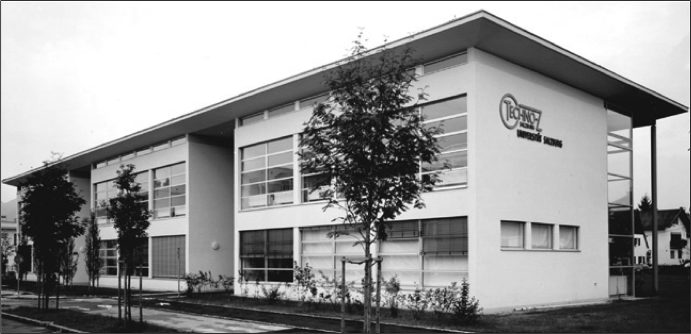

<link href="//maxcdn.bootstrapcdn.com/font-awesome/4.2.0/css/font-awesome.min.css" rel="stylesheet">

[Publications](publications) - [Teaching](https://github.com/rkwitt/teaching) - [Contact](contact)

* * *

I am an associate professor in the [Department of Computer Science](https://informatik.uni-salzburg.at/) at the
[Univ. of Salzburg](https://www.uni-salzburg.at/), Austria. Prior to that, I was part of the medical imaging and computer vision group at [Kitware Inc.](https://www.kitware.com/), North Carolina, USA. My research spans multiple areas, but mostly focusses on developing machine learning methods that
allow to leverage and control structural characteristics of
data.

## News

- **June 2020**: Two papers accepted at [ICML '20](https://icml.cc/Conferences/2020/) (congrats Chris and Florian)

## Research interests

- Machine learning
- Computer vision
- Medical image analysis

## Group

- Christoph D. Hofer (PostDoc)
- Florian Graf (PhD student)
- Sebastian Zeng (PhD student)

## Selected publications

For a complete list of all papers, go to [Publications](publications), or
visit my [Google Scholar](https://scholar.google.at/citations?user=sfGFi6UAAAAJ&hl=de) profile.

<dl>
<dt>
<a href="http://proceedings.mlr.press/v97/hofer19a.html">
<i class="fa fa-file-pdf-o" aria-hidden="true"></i></a>
Connectivity-Optimized Representation Learning via Persistent Homology</dt>
<dd>ICML 2019</dd>    

<dt>
<a href="http://openaccess.thecvf.com/content_cvpr_2018/papers/Liu_Feature_Space_Transfer_CVPR_2018_paper.pdf">
<i class="fa fa-file-pdf-o" aria-hidden="true"></i></a>
Feature-Space Transfer for Data Augmentation</dt>
<dd>CVPR 2018 (Oral)</dd>     

<dt>
<a href="https://arxiv.org/abs/1707.04041">
<i class="fa fa-file-pdf-o" aria-hidden="true"></i></a>
Deep Learning With Topological Signatures</dt>
<dd>NIPS 2017</dd>

<dt>
<a href="https://arxiv.org/abs/1612.02559">
<i class="fa fa-file-pdf-o" aria-hidden="true"></i></a>
AGA: Attribute-Guided Augmentation</dt>
<dd>CVPR 2017 (Oral)</dd>

<dt>
<a href="http://proceedings.mlr.press/v54/hong17b/hong17b.pdf">
<i class="fa fa-file-pdf-o" aria-hidden="true"></i></a>
Regression Uncertainty on the Grassmannian</dt>
<dd>AISTATS 2017 (Oral)</dd>

<dt>
<a href="http://openaccess.thecvf.com/content_cvpr_2016/papers/Kwitt_One-Shot_Learning_of_CVPR_2016_paper.pdf">
<i class="fa fa-file-pdf-o" aria-hidden="true"></i></a>
One-Shot Learning of Scene Locations via Feature Trajectory Transfer</dt>
<dd>CVPR 2016 (Spotlight)</dd>

<dt>
<a href="https://ieeexplore.ieee.org/document/7378521">
<i class="fa fa-file-pdf-o" aria-hidden="true"></i></a>  
Parametric Regression on the Grassmannian</dt>
<dd>IEEE Trans. Pattern Anal. Mach. Intell. 2016</dd>

<dt>
<a href="http://papers.nips.cc/paper/5887-statistical-topological-data-analysis-a-kernel-perspective">
<i class="fa fa-file-pdf-o" aria-hidden="true"></i></a>
Statistical Topological Data Analysis - A Kernel Perspective</dt>
<dd>NIPS 2015</dd>

<dt>
<a href="http://www.cv-foundation.org/openaccess/content_cvpr_2015/papers/Reininghaus_A_Stable_Multi-Scale_2015_CVPR_paper.pdf">
<i class="fa fa-file-pdf-o" aria-hidden="true"></i></a>
A Stable Multi-Scale Kernel for Topological Machine Learning</dt>
<dd>CVPR 2015</dd>

<dt>
<a href="http://www.cvpapers.com/papers/SceneRecognition-eccv2012.pdf">
<i class="fa fa-file-pdf-o" aria-hidden="true"></i></a>
Scene Recognition on the Semantic Manifold</dt>
<dd> ECCV 2012</dd>

<dt>
<a href="https://www.ncbi.nlm.nih.gov/pubmed/23286117">
<i class="fa fa-file-pdf-o" aria-hidden="true"></i></a>
Recognition in Ultrasound Videos: Where Am I?</dt>
<dd>MICCAI 2012 (Oral)</dd>

<dt>
<a href="https://ieeexplore.ieee.org/document/5238618">
<i class="fa fa-file-pdf-o" aria-hidden="true"></i></a>
Lightweight Probabilistic Texture Retrieval</dt>
<dd>IEEE Trans. Image Process. 2010</dd>
</dl>

## Short biography

- since Aug. 2017  
*Associate Professor* \\
Department of Computer Science\\
Univ. of Salzburg
- Nov. 2013 - Aug. 2017  
*Assistant Professor*\\
Department of Computer Science\\
Univ. of Salzburg
- Nov. 2011 - Oct. 2013   
*R&D Engineer*\\
Kitware Inc., NC, USA
- Aug. 2010 - Oct. 2011   
*PostDoc*\\
Department of Computer Science\\
Univ. of Salzburg
- May 2007 - Aug. 2010  
*PhD student*\\
Department of Computer Science\\
Univ. of Salzburg\\
Advisor: [Prof. Andreas Uhl](https://www.uni-salzburg.at/index.php?id=53927&L=1)    

[Curriculum Vitae (CV)](cv-kwitt.pdf)

## Professional service

- General Chair: OAGM/AAPR Workshop 2015 (Salzburg, Austria)
- PC Chair: ACM IH & MMSEC 2014 (Salzburg, Austria)

I regularly serve as a reviewer for the major vision and machine learning
conferences (e.g., CVPR, ICCV, ECCV, BMVC, NIPS, AISTATS, ICIP, ICPR, MICCAI) as
well as the major journals in the field (e.g.,TPAMI, JMLR, IJCV, TMI, TIP, TSP, MedIA).

## Awards

- [CVPR Outstanding Reviewer Award (2014)](http://www.pamitc.org/cvpr14/files/CVPR_2014_Pocket_Guide_Final.pdf)
- [MICCAI Young Scientist Award (2012)](http://www.miccai.org/about-miccai/awards/young-scientist-award/)
- PhD thesis short-listed for the "Heinz-Zemanek" price (2012)
- Special appreciation award (for MSc thesis) of the Austrian ministry of science and research (2005)
