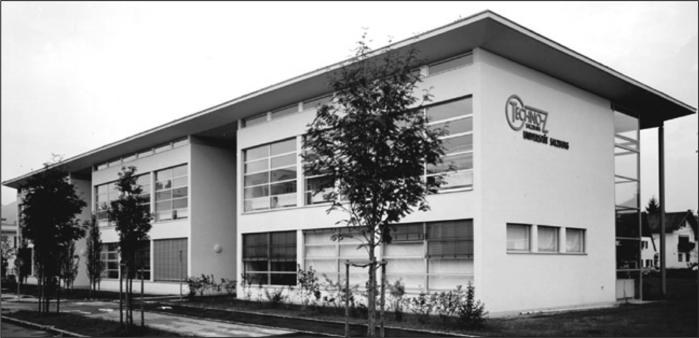

<link href="//maxcdn.bootstrapcdn.com/font-awesome/4.2.0/css/font-awesome.min.css" rel="stylesheet">

[Publications](publications) - [Teaching](https://github.com/rkwitt/teaching) - [Contact](contact)

* * *

I am a full professor for **machine learning** in the [Department of Artificial Intelligence and Human Interfaces (AIHI)](https://plus.ac.at/aihi) at the
[University of Salzburg (PLUS)](https://www.uni-salzburg.at/), Austria (and currently deputy head of the department). Prior to that, I was part of the medical imaging and computer vision group at [Kitware Inc.](https://www.kitware.com/), North Carolina, USA. My research spans multiple areas, but mostly focusses on **theoretical** (and practical :) aspects of learning methods that allow to leverage and control structural characteristics of data. I am also a member of the [ELLIS society](https://ellis.eu).

## News

- **Aug. 2025**: We have released our v1.0rc3 of [flooder](https://github.com/plus-rkwitt/flooder), a lightweight Python package to compute persistent homology on millions of points in low-dimensional Euclidean space. Check it out (`pip install flooder`)- Preprint coming soon (on arXiv)!      

- **March 2025**: Paolo Pellizzoni (from [Karsten Borgwardt's group](https://www.biochem.mpg.de/borgwardt) at the MPI for Biochemistry completed his 6 month research visit with my group. **We already miss u!** Stay tuned, as there will be some great work coming out of this collaboration!     

- **Feb. 2025**: Hastings Greer's and Lin Tian's paper *CARL: A Framework for Equivariant Image Registration* accepted at [CVPR](https://cvpr.thecvf.com/Conferences/2025); joint work with F.-X. Vialard, myself, R. Estepar and M. Niethammer - congrats Hastings and Lin!      

- **Feb. 2025**: Sebastian Zeng successfully defended his PhD thesis - Congrats Sebastian!    

- **September 2024**: *Neural Persistence Dynamics* will be presented at [NeurIPS](https://neurips.cc/) this year! A great collaboration between my group and Stefan Huber's group at the FH Salzburg; congrats to Sebastian, Florian and Martin! Preprint on [arXiv](https://arxiv.org/abs/2405.15732)

- **June 2024**: *uniGradICON: A Foundation Model for Medical Image Registration* will be presented at [MICCAI '24](https://conferences.miccai.org/2024/en/) - Congrats Lin and Hastings!

- **June 2024**: *Neural Persistence Dynamics* just dropped; check out the preprint on [arXiv](https://arxiv.org/abs/2405.15732); joint work 
with F. Graf, M. Uray, S. Huber and myself (code to be released soon - stay tuned!)

- **May 2024**: Check out Hastings Greer's latest preprint on [arXiv](https://arxiv.org/abs/2405.16738) *CARL: A Framework for Equivariant Image Registration* with L. Tian, F.-X. Vialard, myself, R.S.J. Estepar and M. Niethammer  

- **March 2024**: New preprint on [arXiv](https://arxiv.org/abs/2403.05780) *uniGradICON: A Foundation Model for Medical Image Registration* with L. Tian, H. Greer, R. Kwitt, F.-X. Vialard, R. San Jose Estepar, S. Bouix, R. Rushmore and Marc Niethammer - thanks Lin and Hastings for the great work on getting the first **foundation** model for medical image registration out there! 

- **Feb. 2024**: Our position paper *Challenges and Opportunities in Topological Deep Learning* with a lot of great 
authors (from various communities) is available on [arXiv](https://arxiv.org/abs/2402.08871) 

- **September 2023**: *Latent SDEs on Homogeneous Spaces* got *accepted at [NeurIPS '23](https://nips.cc/)* - see our preprint on [arXiv](https://arxiv.org/abs/2306.16248) - congrats Sebastian Zeng and Florian Graf      

- **July 2023**: Checkout my group's latest work on *Latent SDEs on Homogeneous Spaces* on [arXiv](https://arxiv.org/abs/2306.16248) - joint work with Sebastian Zeng and Florian Graf

- **July 2023**: *Multistep Inverse Consistency by Construction* by Hastings Greer, Lin Tian, F.X.-Vialard, myself, Sylvain Bouix, R. Estépar, R. Rushmore and M. Niethammer got *accepted at [MICCAI '23](https://conferences.miccai.org/2023/en/)* - checkout the preprint on [arXiv](https://arxiv.org/abs/2305.00087)   

- **February 2023**: *GradICON: Approximate Diffeomorphisms via Gradient Inverse Consistency* by Hastings Greer, Lin Tian, F.X.-Vialard, myself, R. Estépar, R. Rushmore, N. Makris, S. Bouix and M. Niethammer got *accepted at [CVPR '23](https://cvpr2023.thecvf.com/)*    

- **November 2022**: Check out our latest preprint *GradICON: Approximate Diffeomorphisms via Gradient Inverse Consistency* by Hastings Greer, Lin Tian, F.X.-Vialard, myself, R. Estépar, R. Rushmore, N. Makris, S. Bouix and M. Niethammer on [arXiv](https://arxiv.org/pdf/2206.05897.pdf)

- **September 2022**: Check out our latest work *On Measuring Excess Capacity in Neural Networks* on [arXiv](https://arxiv.org/abs/2202.08070) - a joint effort of Florian Graf, Sebastian Zeng, Bastian Rieck, Marc Niethammer and myself - *now accepted at [NeurIPS '22](https://nips.cc/Conferences/2022/Schedule?showEvent=53355)*

- **August 2022**: My group hosted the [Biannual Austrian TDA meeting](https://biannual-austrian-tda.github.io/) this year, a joint effort by Herbert Edelsbrunner (IST Austria), Michael Kerber (TU Graz) and myself. Great meeting and great talks!

- **January 2022**: As of 01/2022, I will serve as deputy head of the newly founded *Department of Artificial Intelligence and Human Interfaces (AIHI)* at the University of Salzburg.

- **September 2021**: I gave a talk within the [Thematic Mini-Conference on Computational Topology and Machine Learning](https://www3.math.tu-berlin.de/mathplus/TES-Summer2021/) at the TU Berlin - Slides are available [here](http://www.rkwitt.org/media/files/TUBerlin_270921.pdf)

- **September 2021**: Sebastian Zeng's paper *Topological Attention for Time Series Forecasting* has been accepted at [NeurIPS '21](https://nips.cc/Conferences/2021/) - joint work with F. Graf, C. Hofer and myself   

- **July 2021**: Hastings Greer's paper *ICON: Learning Regular Maps Through Inverse Consistency* has been accepted at [ICCV '21](http://iccv2021.thecvf.com/home) - joint work with Marc Niethammer, F.-X. Vialard and myself

- **July 2021**: Chris has left our group to work in industry - Thanks for all the great work over the years!

- **May 2021**: One paper accepted (as long presentation) at [ICML '21](https://icml.cc/) (congrats Chris and Florian)      

- **February 2021**: Our new preprint *Dissecting Supervised Contrastive Learning* (joint work with F. Graf, C. Hofer and M. Niethammer) is available at [here](https://arxiv.org/abs/2102.08817)

- **September 2020**: One paper (joint work with S. Wei, F.-X. Vialard and M. Niethammer) accepted (as oral) for [NeurIPS '20](https://neurips.cc)

- **August 2020**: We will be organizing a [NeurIPS '20](https://nips.cc/Conferences/2020/) workshop on [Topological Data Analysis and Beyond](https://nips.cc/Conferences/2020/Schedule?showEvent=16159) (with B. Rieck, F. Chazal, S. Krishnaswamy, K.N. Ramamurthy, Y. Umeda and G. Wolf)

- **June 2020**: Two papers accepted at [ICML '20](https://icml.cc/Conferences/2020/) (congrats Chris and Florian)

## Research interests

- Machine learning
- Computer vision
- Medical image analysis

## Current group members

- Florian Graf (PostDoc, graduated 2023)
- Dominik Geng (PhD student)
- Martin Uray (PhD student; co-supervision with Stefan Huber)

## Past group members

- Sebastian Zeng (PhD student, now PostDoc at Linnaeus University)
- Günther Eder (PostDoc, now in industry)
- Christoph Hofer (PhD student and PostDoc, now in industry)

## Selected publications

Below is a list of (from my perspective) noteworthy publications from the past decade. For a complete list of all papers, go to [Publications](publications), or visit my [Google Scholar](https://scholar.google.at/citations?user=sfGFi6UAAAAJ&hl=de) profile.

<dl>
<dt>
<a href="https://proceedings.neurips.cc/paper_files/paper/2024/file/3a509449a73fd0aab8c0cf5705827036-Paper-Conference.pdf">
<i class="fa fa-file-pdf-o" aria-hidden="true"></i></a>
Neural Persistence Dynamics</dt>
<dd> NeurIPS 2024, ranked A*</dd>   

<dl>
<dt>
<a href="https://proceedings.neurips.cc/paper_files/paper/2022/file/420492060687ca7448398c4c3fa10366-Supplemental-Conference.pdf">
<i class="fa fa-file-pdf-o" aria-hidden="true"></i></a>
On Measuring Excess Capacity in Neural Networks</dt>
<dd> NeurIPS 2022, ranked A*</dd>    

<dl>
<dt>
<a href="https://proceedings.mlr.press/v139/graf21a.html">
<i class="fa fa-file-pdf-o" aria-hidden="true"></i></a>
Dissecting Supervised Contrastive Learning</dt>
<dd> ICML 2021 (long presentation), ranked A*</dd>    

<dl>
<dt>
<a href="http://proceedings.mlr.press/v97/hofer19a.html">
<i class="fa fa-file-pdf-o" aria-hidden="true"></i></a>
Connectivity-Optimized Representation Learning via Persistent Homology</dt>
<dd>ICML 2019, ranked A*</dd>    

<dt>
<a href="http://openaccess.thecvf.com/content_cvpr_2018/papers/Liu_Feature_Space_Transfer_CVPR_2018_paper.pdf">
<i class="fa fa-file-pdf-o" aria-hidden="true"></i></a>
Feature-Space Transfer for Data Augmentation</dt>
<dd>CVPR 2018 (Oral), ranked A*</dd>     

<dt>
<a href="https://arxiv.org/abs/1707.04041">
<i class="fa fa-file-pdf-o" aria-hidden="true"></i></a>
Deep Learning With Topological Signatures</dt>
<dd>NIPS (now NeurIPS) 2017, ranked A*</dd>

<dt>
<a href="https://arxiv.org/abs/1612.02559">
<i class="fa fa-file-pdf-o" aria-hidden="true"></i></a>
AGA: Attribute-Guided Augmentation</dt>
<dd>CVPR 2017 (Oral), ranked A*</dd>

<dt>
<a href="http://openaccess.thecvf.com/content_cvpr_2016/papers/Kwitt_One-Shot_Learning_of_CVPR_2016_paper.pdf">
<i class="fa fa-file-pdf-o" aria-hidden="true"></i></a>
One-Shot Learning of Scene Locations via Feature Trajectory Transfer</dt>
<dd>CVPR 2016 (Spotlight), ranked A*</dd>

<dt>
<a href="http://papers.nips.cc/paper/5887-statistical-topological-data-analysis-a-kernel-perspective">
<i class="fa fa-file-pdf-o" aria-hidden="true"></i></a>
Statistical Topological Data Analysis - A Kernel Perspective</dt>
<dd>NIPS (now NeurIPS) 2015, ranked A*</dd>

<dt>
<a href="http://www.cv-foundation.org/openaccess/content_cvpr_2015/papers/Reininghaus_A_Stable_Multi-Scale_2015_CVPR_paper.pdf">
<i class="fa fa-file-pdf-o" aria-hidden="true"></i></a>
A Stable Multi-Scale Kernel for Topological Machine Learning</dt>
<dd>CVPR 2015, ranked A*</dd>

## Short biography

- since Jan. 2022     
*Full Professor*     
Department of Artificial Intelligence and Human Interfaces    
Univ. of Salzburg    
- Dec. 2020 to Jan. 2022  
*Full Professor*      
Department of Computer Science     
Univ. of Salzburg      
- Aug. 2017 to Dec. 2020    
*Associate Professor*      
Department of Computer Science     
Univ. of Salzburg     
- Nov. 2013 to Aug. 2017  
*Assistant Professor*     
Department of Computer Science     
Univ. of Salzburg     
- Nov. 2011 to Oct. 2013   
*R&D Engineer*     
Kitware Inc., NC, USA     
- Aug. 2010 - Oct. 2011   
*PostDoc*      
Department of Computer Science      
Univ. of Salzburg     
- May 2007 to Aug. 2010  
*PhD student*     
Department of Computer Science     
Univ. of Salzburg     

[Curriculum Vitae (CV)](cv-kwitt.pdf)

## Professional service

- Area Chair (AC) for NeurIPS 2021-now, ICML 2021-now, AAAI 2023-now, ICLR 2025
-  General Chair: OAGM/AAPR Workshop 2015 (Salzburg, Austria)
- PC Chair: ACM IH & MMSEC 2014 (Salzburg, Austria)
- Organized the *Biannual Austrian TDA Meeting* in 2022 (in Salzburg, Austria)
- Reviewer for the ERC grant applications

I regularly also serve as a reviewer for the major vision and machine learning
conferences (e.g., ICML, NeurIPS, CVPR, ICCV, ECCV, BMVC, AISTATS, MICCAI, ICLR) as well as the flagship journals in the field (e.g., TPAMI, JMLR, IJCV, TMI, TIP, TSP, MedIA).

## Awards

- [CVPR Outstanding Reviewer Award (2014)](http://www.pamitc.org/cvpr14/files/CVPR_2014_Pocket_Guide_Final.pdf)
- [MICCAI Young Scientist Award (2012)](http://www.miccai.org/about-miccai/awards/young-scientist-award/)
- PhD thesis short-listed for the "Heinz-Zemanek" price (2012)
- Special appreciation award (for MSc thesis) of the Austrian ministry of science and research (2005)
